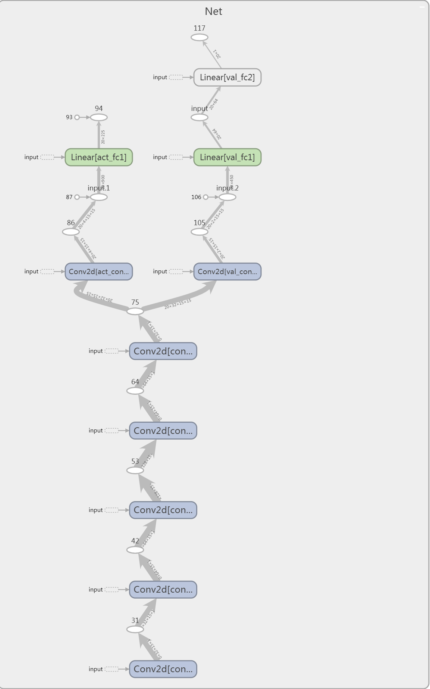

# Gomoku training model based on Covolutional Neural Network

1. You need pytorch to run this program: https://pytorch.org/

2. The program runs on CPU by default. To run on CUDA, enable GPU mode of train() evaluate() in trainer.py and PolicyValueNet() in torchCNN.py

3. More training games are in sgf.zip 

Updates:

5/15/2019
1.  Added rotated/flipped data. pytorch supports online data augmentation only for img but not tensor.

---
Author:
- Xiaowei Xu
---

Abstract
========

This project is inspired by Deep Mind's Alpha Go paper. 
In this project, the goal is to apply Alpha Go's partial techniques (without using Monte-Carlo tree)
on Gomoku and constuct a suitable neural network structure to achieve good results. 
\
(Gomoku is a board game which plays on Go board with 15\*15 grid. Players
take turn placing black and white pieces on an empty grid intersection.
The first player who make 5 pieces in a row horizontally, vertically or
diagonally wins the game.)

Achievement
===========

I build a working model for Gomoku, and fulfill partial goal of
proposal.The best model achieves 47% testing accuracy and 55% \"around 1
accuracy\". 

Collection of play data
=======================

Influenced by self-training philosophy of Alpha Zero, my original plan
is to collect play data by two Min-max AIs contest with each other, with
tuned depth and random choices among best several moves. Intuitively
randomness is guaranteed in this case.
In this project i collect sgf format play data from pro plays online, and
use open-source reader class to cast them into array, then transform
them into Pytorch tensor. The advantage is data is well distributed and
does not emphasize on early stage of game.

Features and Labels
===================

Feature is single board of a 15\*15 matrix, which black pieces are
represented as 2, white pieces are represented as 1. Label is also
single 225 1-d tensor, on which there is only one non-zero value 2,
representing next black move of the corresponding feature board. As it
shows, the features and labels only represents black moves so we don't
have to deal with extra features for representing who is current player
(which is quite important in board game). Features are transformed in
form of (batch, 1, height, width) as required by Pytorch; labels are
transformed into 0-d tensor, carries the argmax of next move. The neural
network will predict one of 225 classes, each for 1 spot on the board.

Neural Network
==============

Following the paper and some open source implementations, i use
convolutional NN with relu activation function between each layers. From
my limited understanding, CNN has a good performance on identifying
gomoku piece patterns, as it is very similar to discovering the
relationship between nearby pixels in image classification. There are 5
CNN layers with 3\*3 filter, which is enough to capture most powerful
pattern in Gomoku play, followed by one layer CNN with 1\*1. After 1
full connect layer, it outputs argmax of 1d tensor with softmax
function. The structure is shown in the graph, right branch abandoned.

Evaluation
==========

Initially the play data consists of about 2300 games. I split 2000 of
them to training data and 300 of them to testing data. Data is shuffled
for each epoch. The accuracy is based on if the NN predicts label, and
not very precisely, if the prediction is very close to the label on the
board. (1 spot) This measure can prove the model learns from nearby
spots. After 20 epochs, training accuracy grows from 13% to 34%, while
testing accuracy grows from 9.5% to 18%. In \"around 1 accuracy\",
training grows from 27% to 45%, and testing grows from 25% to 29%. After
ecoch 13, both accuracy and \"around 1 accuracy"" show sign of
overfitting, Testing accuracies get stable as training keeps increasing.
Here is accuracies for 2000 games training set:

![Accuracies after 20
epochs[]{label="fig:label"}](myplot1.png)

![Around 1 accuracies after 20
epochs[]{label="fig:label"}](myplot2.png)

After realizing the bottleneck could be the shortage of training data, i
collected 5000 more games for the training set, end up with an obvious
boost on testing accuracies. The model reaches 46% testing accuracies
after 10 epochs. After epoch 10, the model shows sign of overfitting.
Here is accuracies for 7000 games training set:

![Accuracies after 11
epochs[]{label="fig:label"}](more1.png)

![Around 1 accuracies after 11
epochs[]{label="fig:label"}](more2.png)

For comparison, in a related paper \[1\] the group gets 42% testing
accuracy by 10 layers CNN, with 66000 games training data, and TitanX
GPU. Considering to the time and computing resources constraint, the
result is surprisingly outstanding.

Future work
===========

The labels collection from actual games are more complex and hard to
find pattern, which is not as good for practice as if we generate labels
from evaluation function, since it's harder to build a working model
base on my ability. In short term, i will feed evaluation function score
along with the best prediction into the NN as labels and implement both
regression and classification. Also if in need i can augment the board
data by flip and rotation. In long term, i still hope to reproduce the
original Alpha-zero implementation, This is definitely a good practice.

Reference
=========

sgf file reader class, and partial training data is from here:
https://github.com/zhengtianqi94/AIGoBang CNN structure is learned from
the implementation here:
https://github.com/junxiaosong/AlphaZero\_Gomoku

\[1\]Shao, K & Zhao,D et al. (2016). Move prediction in Gomoku using
deep learning. 292-297. 10.1109/YAC.2016.7804906.  

\[2\]Silver, D & Huang, A et al. (2016). Mastering the game of Go with
deep neural networks and tree search. Nature. 529. 484-489.
10.1038/nature16961.

\[3\]Silver, D& Schrittwieser, J al.(2017). Mastering the game of Go
without human knowledge. Nature. 550. 354-359. 10.1038/nature24270.
